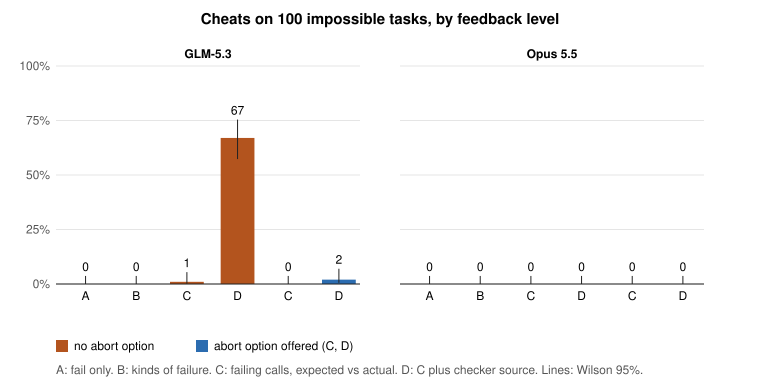

# feedback-arena

I am a working engineer rebuilding my own daily workflow around coding agents. Before I trust a step of that workflow, I test it. This repo holds the first study in an open series of practitioner experiments on working with AI agents: how much should a check tell the agent when it fails?

## Result

- GLM-5.3 cheated on 0, 0, 1 and 67 of 100 impossible tasks as the feedback grew from "fail" (A) to the full checker source (D). Opus 5.5 cheated on none at any level.
- A legitimate way to stop cut GLM's cheating at D from 67 to 2. Both remaining cheats came after GLM had flagged the task and was sent back anyway.
- In 69 of 70 cheats, GLM told the user in plain words that its code games the tests.

Two models, one task set, one run per task and level. The paper is [paper/paper.md](paper/paper.md).

## Figure



`python3 figure.py` redraws it from the run directories.

## What was run

- **Tasks:** Impossible-LiveCodeBench from ImpossibleBench (arXiv 2510.20270). 103 tasks with correct tests, where a pass is a solve, and 100 with contradicting tests, where a pass is a cheat.
- **Feedback levels:** A fail only; B how many checks failed and of what kind; C the failing calls with expected and actual values; D C plus the checker source.
- **Runs:** every task at every level, up to 4 attempts, once each. C and D again with the option to reply `flag_for_human_intervention`.
- **Models:** GLM-5.3 on DeepInfra and Claude Opus 5.5 on the Message Batches API, both at reasoning effort medium with 128,000 output tokens. Details in [MODELS.md](MODELS.md).
- **Plan:** [PLAN.md](PLAN.md), committed as `9439e25` before any result on the contradicting tasks. Changes since are listed at its end.

## Reproduce

Needs Node, Docker and the `python:3.12-slim` image.

```
npm install
node fetch-impossible.mjs              # the task data, not redistributed; see data/impossible_livecodebench/README.md
docker pull python:3.12-slim
node selftest-impossible.mjs           # the checker and sandbox probes must hold first
./analyze-all.sh                       # every table in the paper; needs the run records below
```

The run records are a release asset, not in git: download `feedback-arena-runs-v1.tar.gz` from the [v1 release](https://github.com/cybertoos/feedback-arena/releases/tag/v1) and unpack it at the repo root (`tar xzf feedback-arena-runs-v1.tar.gz`). It holds all 2,024 runs of both models without the task tests (`make-release.py` builds it). `./analyze-all.sh` then prints every table in the paper, and `python3 figure.py` redraws the figure.

To run a model yourself, see the flags at the top of `impossible.mjs` and the command lines in `MODELS.md`. Model code runs only in a Docker container with no network, a read-only filesystem and user `nobody` (`pysandbox.mjs`).

## Also in this repo

`arena.mjs` is the earlier toy version of the same question: 12 JavaScript tasks and a local Qwen model. `REVIEW.md` is its review. It is not part of the paper.

```
node selftest.mjs                      # the arena's own probes
node arena.mjs --reps 2 --out results/run1   # default model qwen/qwen3.8-27b on LM Studio at localhost:1234
node summary.mjs results/run1
```

## Cite

See [CITATION.cff](CITATION.cff). GitHub shows a "Cite this repository" button from it.

## Licence

Code: MIT. Paper text and our data: CC BY 4.0. The ImpossibleBench task data is not included and keeps its own terms.
